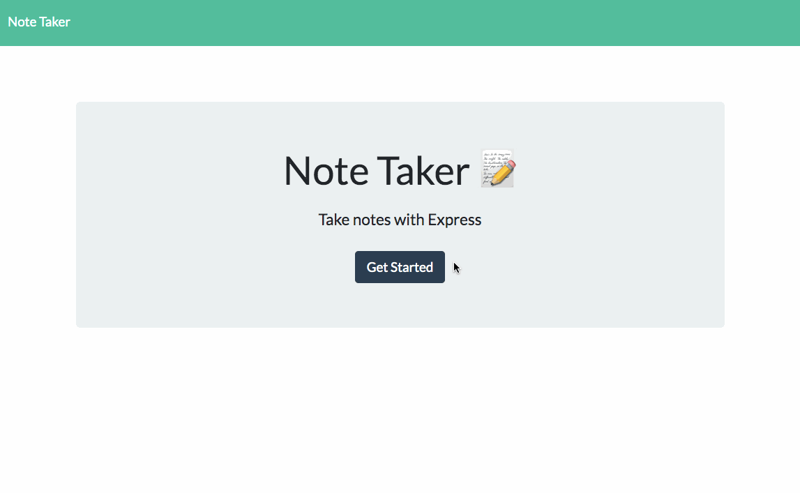
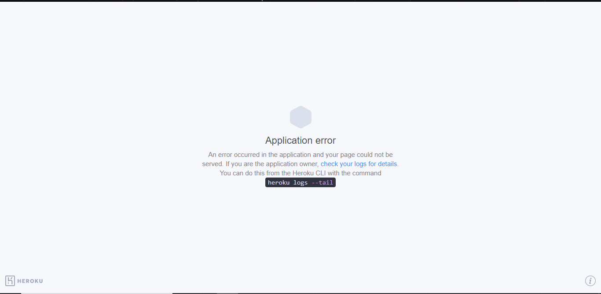

# Note Taker **([Link](https://salty-plateau-23106.herokuapp.com/))**

This is an application which allows the user to take notes, save those notes, delete those notes, and still have access to them upon reload of the page. All data is being handled within Node.js utilizing the Express.js library.

## Getting Started (Disclaimer)

Please note that upon trying to visit the deployed link, you may be met with a page that looks like this:

This does **NOT** mean that the app is not working! This app is being hosted on a free Heroku account. When the site hasn't been pinged for a while, the nodes will go to sleep. They sometimes need a few minutes to wake up again and rebuild the app.

## Built With

- [NodeJS](https://nodejs.org/en/)
- [ExpressJS](https://expressjs.com/en/)
- [Javascript](https://developer.mozilla.org/en-US/docs/Web/JavaScript)
- [HTML](https://developer.mozilla.org/en-US/docs/Web/HTML)
- [CSS](https://developer.mozilla.org/en-US/docs/Web/CSS)

## Deployed Link

- [Live Site Here](https://salty-plateau-23106.herokuapp.com/)

## Author

**Matt Stephens**

- [Link to Portfolio Site](https://mstephen19.github.io/newestPortfolio)
- [Link to Github](https://github.com/mstephen19)
- [Link to LinkedIn](https://www.linkedin.com/mstephen19)

## License

This project is licensed under the MIT License

## Acknowledgments

- Shoutout to [Jerome](https://www.linkedin.com/in/jeromechenette/) for being such a fantastic instructor
